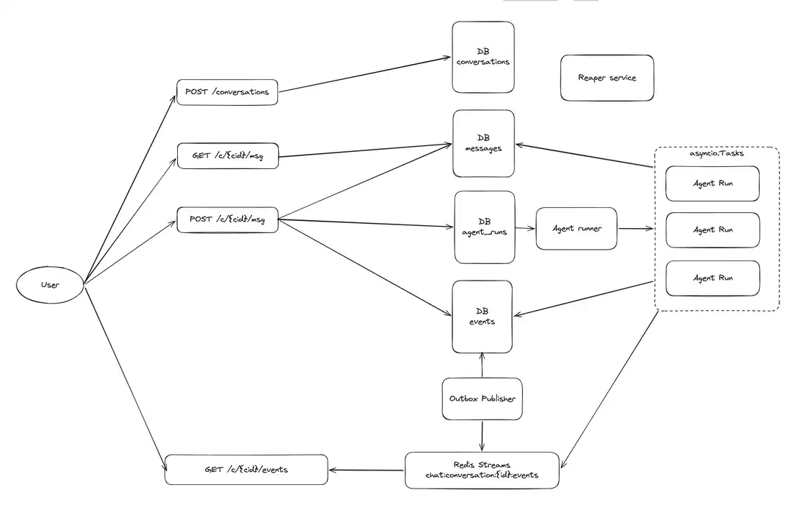

# OKF Agent

Simple durable agent implementation.

Main goal for this repo is to experiment with using OKF formatted data for RAG, probably encoded into knowledge graph and also to try making a graph based hybrid memory.

### How to run

1. Install dependencies for both BE and FE:

```bash
uv sync
pnpm install
```

2. Run docker compose for PostgreSQL and Redis

```bash
docker compose up -d
```

3. Copy env variables file and insert your own `OPENAI_API_KEY` (agent right now is using `gpt-5.4-nano`).

```bash
cp .env.example .env
```

4. Start BE and FE apps:

```bash
# BE app
uv run fastapi dev

# FE app
pnpm --filter web dev
```

5. Open the web app interface in the browser, by default its [http://localhost:5173/](http://localhost:5173/)

### Tech stack

**FE**: Typescript React app. Vibecoded, not too important for my experiments so didn't wanted to spend much time on it.

**BE**: Python FastAPI app, Langchain agent, PostgreSQL for DB and durable queue, Redis for event streams for realtime updates via SSE, Neo4j for graphs.

### Architecture

For the agent itself, the general architecture as follows:



RAG pipeline architecture is TBD.
